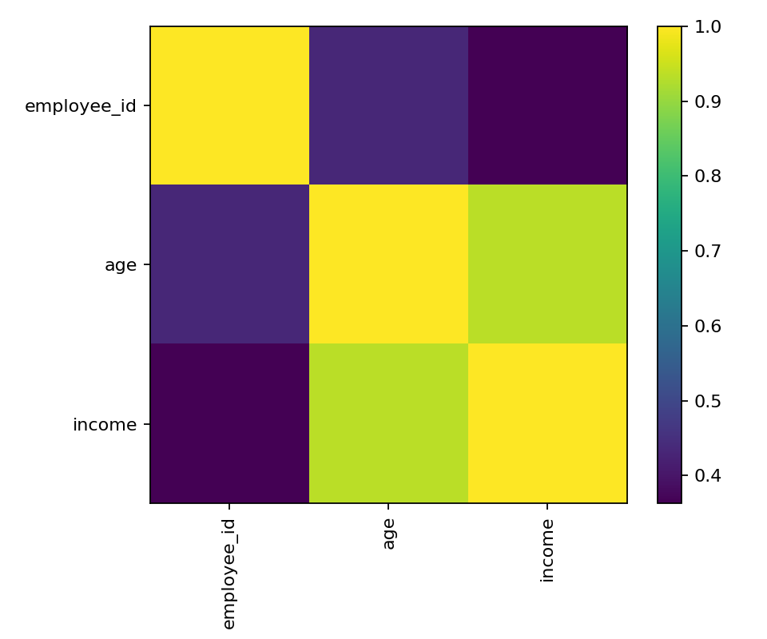
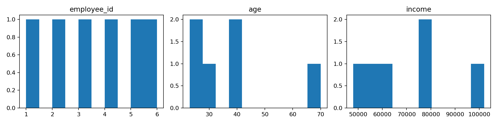

# datainspector

A lightweight Python library for exploring and validating structured datasets. `datainspector` provides a standardized way to profile your data, validate it against schemas, and generate comprehensive HTML reports—all with minimal code.

## Features

- **Data Profiling**: Automatically compute dataset statistics including shape, data types, missing values, correlations, and distributions
- **Schema Validation**: Validate DataFrames against JSON schemas with support for type checking, range validation, allowed values, and regex patterns
- **Report Generation**: Generate beautiful HTML reports that combine profiling insights and validation results with visualizations
- **Standardized API**: Consistent output format makes it easy to integrate into data pipelines and reporting workflows

## Installation

Install from source:

```bash
git clone <repository-url>
cd datainspector-project
pip install -e .
```

Or install dependencies directly:

```bash
pip install pandas numpy matplotlib seaborn
```

## Quick Start

```python
import pandas as pd
from datainspector import DataProfiler, DataValidator, ReportGenerator

# Load your data
df = pd.read_csv("your_data.csv")

# Profile the dataset
profiler = DataProfiler(df, output_dir="reports")
profile_summary = profiler.summarize()
corr_info = profiler.correlate()
dist_fig_path = profiler.visualize_distributions()

# Validate against a schema (optional)
validator = DataValidator.load_schema("schema.json")
validation_results = validator.validate(df)

# Generate a report
report_gen = ReportGenerator(output_dir="reports")
html_path = report_gen.compile_report(
    profile=profile_summary,
    validation=validation_results,
    corr_fig=corr_info.get("figure_path"),
    dist_fig=dist_fig_path,
)

print(f"Report saved to: {html_path}")
```

## Usage Examples

### Running the Demo

A complete example is provided in `run_demo.py`:

```bash
python run_demo.py
```

This will:
1. Load the example dataset from `examples/benefits_small.csv`
2. Validate it against `examples/benefits_schema.json`
3. Generate profiling statistics and visualizations
4. Create an HTML report in the `reports/` directory

After running the command "python run_demp.py", It creates
1. correlation_heatmap.png


2. datainspector_report.html
```html
<h1>datainspector Example Report</h1>
<p><em>Generated: 2025-12-05 19:35:16</em></p>
<h2>Dataset Overview</h2>
<table border='1' cellspacing='0' cellpadding='0'><tr><th style='text-align:left;padding:4px 8px'>Shape</th><td style='padding:4px 8px'><pre style='margin:0'>(6, 6)</pre></td></tr><tr><th style='text-align:left;padding:4px 8px'>Duplicate rows</th><td style='padding:4px 8px'><pre style='margin:0'>0</pre></td></tr></table>
<h2>Missingness (%)</h2>
<table border='1' cellspacing='0' cellpadding='0'><tr><th style='text-align:left;padding:4px 8px'>employee_id</th><td style='padding:4px 8px'><pre style='margin:0'>0.0</pre></td></tr><tr><th style='text-align:left;padding:4px 8px'>age</th><td style='padding:4px 8px'><pre style='margin:0'>0.0</pre></td></tr><tr><th style='text-align:left;padding:4px 8px'>income</th><td style='padding:4px 8px'><pre style='margin:0'>0.0</pre></td></tr><tr><th style='text-align:left;padding:4px 8px'>plan</th><td style='padding:4px 8px'><pre style='margin:0'>0.0</pre></td></tr><tr><th style='text-align:left;padding:4px 8px'>join_date</th><td style='padding:4px 8px'><pre style='margin:0'>0.0</pre></td></tr><tr><th style='text-align:left;padding:4px 8px'>email</th><td style='padding:4px 8px'><pre style='margin:0'>0.0</pre></td></tr></table>
<h2>Dtypes</h2>
<table border='1' cellspacing='0' cellpadding='0'><tr><th style='text-align:left;padding:4px 8px'>employee_id</th><td style='padding:4px 8px'><pre style='margin:0'>int64</pre></td></tr><tr><th style='text-align:left;padding:4px 8px'>age</th><td style='padding:4px 8px'><pre style='margin:0'>int64</pre></td></tr><tr><th style='text-align:left;padding:4px 8px'>income</th><td style='padding:4px 8px'><pre style='margin:0'>int64</pre></td></tr><tr><th style='text-align:left;padding:4px 8px'>plan</th><td style='padding:4px 8px'><pre style='margin:0'>object</pre></td></tr><tr><th style='text-align:left;padding:4px 8px'>join_date</th><td style='padding:4px 8px'><pre style='margin:0'>object</pre></td></tr><tr><th style='text-align:left;padding:4px 8px'>email</th><td style='padding:4px 8px'><pre style='margin:0'>object</pre></td></tr></table>
<h2>Validation Summary</h2>
<p><strong>Overall:</strong> FAIL</p>
<h3>Per-Column Issues</h3><ul>
<li><strong>email</strong>: 1 value(s) fail regex &#x27;[^@\s]+@[^@\s]+\.[^@\s]+&#x27;</li>
</ul>
<h2>Correlation Heatmap</h2>

<h2>Distributions</h2>

```
3. distributions.png


### Data Profiling

```python
from datainspector import DataProfiler
import pandas as pd

df = pd.read_csv("data.csv")
profiler = DataProfiler(df, output_dir="reports")

# Get a comprehensive summary
summary = profiler.summarize()
print(f"Dataset shape: {summary['shape']}")
print(f"Missing values: {summary['missing_pct']}")
print(f"Duplicate rows: {summary['duplicate_rows']}")

# Compute correlations and generate heatmap
corr_info = profiler.correlate()
print(f"Correlation matrix saved to: {corr_info['figure_path']}")

# Generate distribution plots
dist_path = profiler.visualize_distributions(max_cols=12)
print(f"Distributions saved to: {dist_path}")
```

### Schema Validation

Create a JSON schema file to define validation rules:

```json
{
  "columns": {
    "employee_id": {
      "type": "int",
      "required": true,
      "min": 1
    },
    "age": {
      "type": "int",
      "required": true,
      "min": 18,
      "max": 80
    },
    "plan": {
      "type": "string",
      "required": true,
      "allowed": ["Basic", "Standard", "Premium"]
    },
    "email": {
      "type": "string",
      "required": true,
      "regex": "[^@\\s]+@[^@\\s]+\\.[^@\\s]+"
    }
  }
}
```

Then validate your data:

```python
from datainspector import DataValidator
import pandas as pd

df = pd.read_csv("data.csv")
validator = DataValidator.load_schema("schema.json")
results = validator.validate(df)

if results["passed"]:
    print("All validation checks passed!")
else:
    print("Validation failed:")
    for error in results["errors"]:
        print(f"  - {error}")
    for col, res in results["columns"].items():
        if res["issues"]:
            print(f"  {col}: {', '.join(res['issues'])}")
```

### Report Generation

```python
from datainspector import DataProfiler, DataValidator, ReportGenerator
import pandas as pd

df = pd.read_csv("data.csv")

# Profile and validate
profiler = DataProfiler(df, output_dir="reports")
profile = profiler.summarize()
corr_info = profiler.correlate()
dist_path = profiler.visualize_distributions()

validator = DataValidator.load_schema("schema.json")
validation = validator.validate(df)

# Generate report
report_gen = ReportGenerator(output_dir="reports", title="My Data Report")
html_path = report_gen.compile_report(
    profile=profile,
    validation=validation,
    corr_fig=corr_info.get("figure_path"),
    dist_fig=dist_path,
)
```

## API Reference

### DataProfiler

High-level dataset profiler that wraps common pandas/numpy operations.

**Methods:**

- `summarize() -> Dict[str, Any]`: Compute and return a structured summary including:
  - `shape`: Tuple of (rows, columns)
  - `dtypes`: Column name to data type mapping
  - `missing_counts`: Column name to missing value count
  - `missing_pct`: Column name to missing value percentage
  - `duplicate_rows`: Number of duplicate rows
  - `describe_numeric`: Statistical summary for numeric columns
  - `cardinality`: Unique value counts for non-numeric columns

- `correlate(method: str = "pearson") -> Dict[str, Any]`: Compute correlation matrix and generate heatmap visualization. Returns dict with `matrix` (DataFrame) and `figure_path` (str).

- `visualize_distributions(max_cols: int = 12) -> Optional[str]`: Create histograms for numeric columns. Returns path to saved PNG file.

### DataValidator

Validate pandas DataFrames against JSON schemas.

**Schema Format:**

```json
{
  "columns": {
    "column_name": {
      "type": "int" | "float" | "string" | "bool" | "date",
      "required": true | false,
      "min": number,
      "max": number,
      "allowed": [value1, value2, ...],
      "regex": "pattern"
    }
  }
}
```

**Methods:**

- `load_schema(schema_path: str) -> DataValidator`: Class method to load schema from JSON file.

- `validate(df: pd.DataFrame) -> Dict[str, Any]`: Run validation checks. Returns dict with:
  - `passed`: Boolean indicating overall validation status
  - `errors`: List of global errors (e.g., missing required columns)
  - `warnings`: List of warnings (reserved for future use)
  - `columns`: Dict mapping column names to validation results

- `generate_summary(results: Dict[str, Any]) -> str`: Generate human-readable validation summary.

### ReportGenerator

Compile profiling and validation results into HTML reports.

**Methods:**

- `compile_report(profile, validation, corr_fig, dist_fig) -> str`: Build and save HTML report. Returns path to saved file.

- `export(html_path: str, as_markdown: bool = False) -> str`: Export report in different formats (currently returns HTML path).

## Project Structure

```
datainspector-project/
├── datainspector/          # Main package
│   ├── __init__.py         # Package initialization
│   ├── profiler.py         # DataProfiler class
│   ├── validator.py        # DataValidator class
│   └── report.py           # ReportGenerator class
├── examples/               # Example data and schemas
│   ├── benefits_schema.json
│   └── benefits_small.csv
├── reports/                # Generated reports (created at runtime)
├── tests/                  # Unit tests
│   ├── test_profiler.py
│   ├── test_validator.py
│   └── test_report.py
├── run_demo.py            # Example usage script
├── setup.py               # Package setup
└── requirements.txt       # Dependencies
```

## Dependencies

- `pandas`: Data manipulation and analysis
- `numpy`: Numerical computing
- `matplotlib`: Plotting and visualization
- `seaborn`: Statistical data visualization

## Testing

Run the test suite:

```bash
pytest -q
```

## License

[Add your license information here]

## Contributing

[Add contribution guidelines here]

